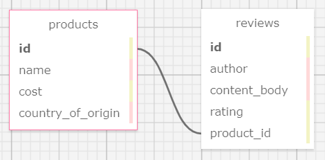

# Mario's Products and Reviews
#### **Author: Mekinsie Callahan**
* * *

## Description

This app allows admin to add, update and delete new products. In addition, users may add, edit and delete reviews for these products. This app also utilizes a one-to-many relationship between products and their reviews.

## Technologies used

* HTML
* Bootstrap
* CSS
* git
* Ruby on Rails
* Embedded Ruby (ERB)
* RSpec
* Bundler
* PostgreSQL

* * *
## User Stories
* As an admin or user, I want to be able to create an account.
* As an admin or user, I should be able to log in and log out of the application.
* As a user, I want to be able to add, update and delete my own product reviews.
* As a user, I cannot edit or delete other user's reviews.
* As ad admin or user, I want to be able to click an individual product to see its detail page.
* As ad admin or user, I want to see a list of all products.
* As an admin, I should be able to add, update and delete products.
* Ass an admin, I want to ensure that other users don't have access to CRUD functionality for a product.
* As an admin, I should be able to delete reviews.
* * *
## Schema



* * *
## Software Requirements
* **Ruby is required to run this application**
* **PostgreSQL is required to run the database**  

 <a href="https://www.learnhowtoprogram.com/ruby-and-rails/getting-started-with-ruby/installing-ruby">Ruby download instructions</a>  
  <a href="https://www.learnhowtoprogram.com/ruby-and-rails/getting-started-with-ruby/installing-postgres">PosgreSQL download instructions</a>  

## Installation Instructions
1. Navigate to the desired directory where you would like to clone the project to.

2. Once you have chosen your desired directory, clone the github repo using the version control tool `git` (<a href="https://www.learnhowtoprogram.com/introduction-to-programming/getting-started-with-intro-to-programming/git-and-github">download instructions</a>). Typing the following command into your terminal:
```bash
$ git clone https://github.com/mekinsie/gathered_analysis
```
3. Open the project in VSCode by typing the following in your terminal:

``` bash
$ code .
```
* Note: VSCode is a code editing software. If you don't already have it, you can download it <a href="https://code.visualstudio.com/">here</a>

4. While located in the root directy, install gem bundler by typing:

``` bash
$ gem install bundler
```

5. Install gem bundles by typing:

``` bash
$ bundle install
```

6. Create a database for this project by typing the following into your terminal while located in the root directory:
```
$ rake db:create
```

7. Add all tables to the database by typing the following in your terminal:
```
$ rake db:migrate
```

8. Seed the databse using Faker by typing the following into your terminal:
```
$ rake db:seed
```
The databse should now be correctly set up. And you may start a local server to interact with the project. 

9. To start a local server, type the following into your terminal:
```
$ rails s
```
10. Open your default browser and type "localhost:3000" into the search bar and press enter. Here, you will see the live server.

## Running Tests
* This application was created using test-driven development (TDD).
* To run the tests yourself, follow the steps below.

Simply type "rspec" into your terminal while located in the root directory of the project.
``` bash
$ rspec
```
* * *

## License
> [GPLv3](https://choosealicense.com/licenses/gpl-3.0/)\
> Mekinsie Callahan &copy; 2021  
* * *

## Contact Information

Reach Mekinsie via <a href="https://www.linkedin.com/in/mekinsie/" target="_blank">Linkedin</a> or <a href="mailto:mekinsie.aja@gmail.com" target="_blank">email</a></li>.